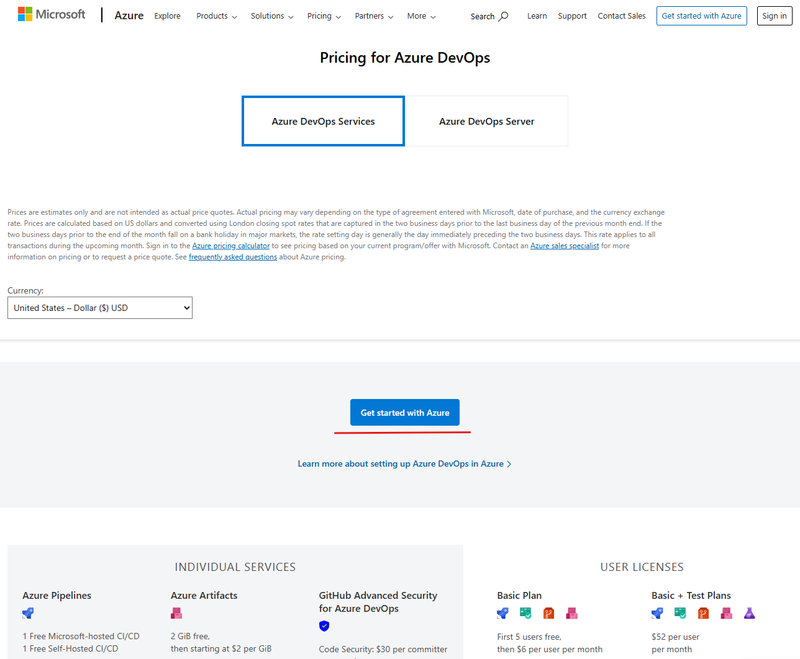
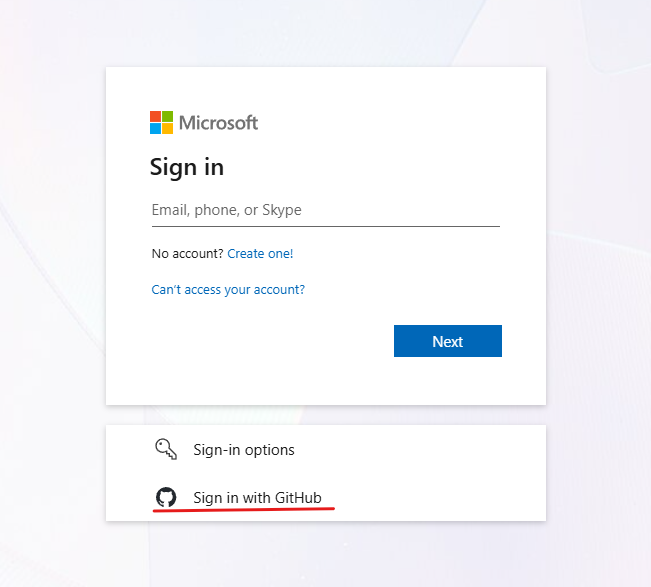
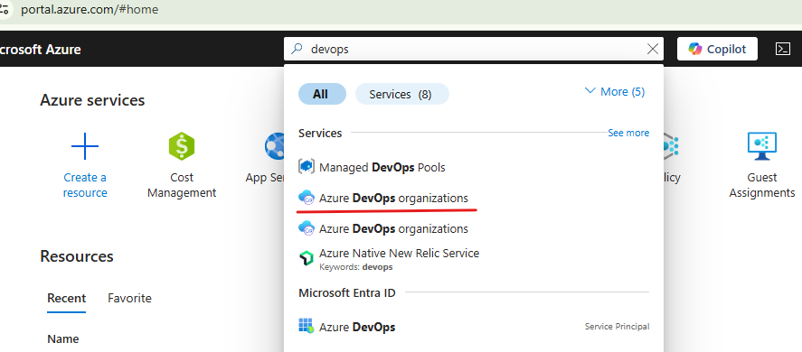
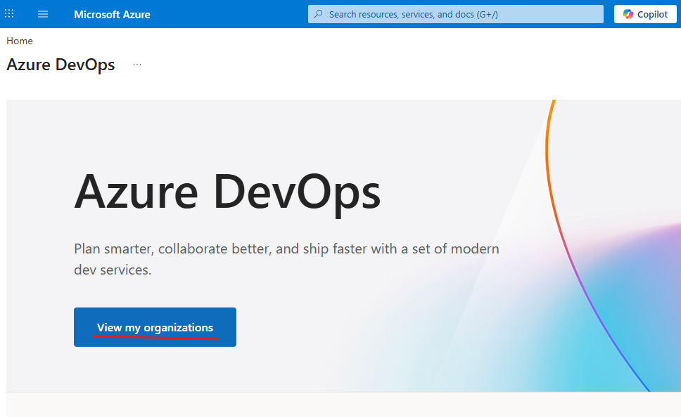
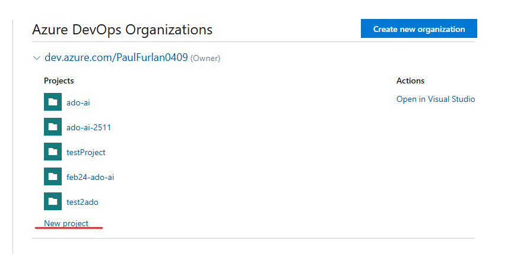
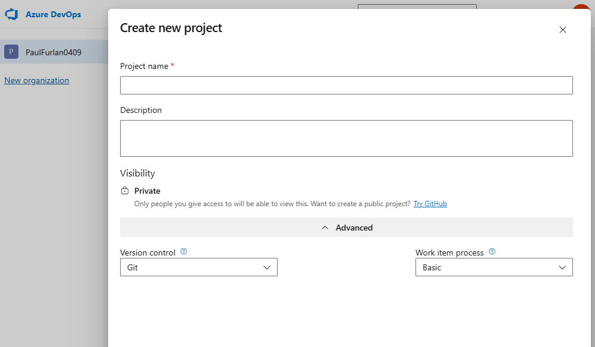

   # AgenticAiForDevSecOps

  This repository contains the lab instructions for the 'Agentic AI for DevSecOps' Oreilly Live Lesson  
  
 Follow the instruction in the [Getting started](#getting-started) setion to set up the necessary accounts for these labs.
 

1. [Lab 1: Explore AI models and set up GitHub Copilot](./lab1.md)
1.  [Lab 2: Create a project with AI in Codespaces](./lab2.md)
1.  [Lab 3: Use pull requests to integrate code changes](./lab3.md)
1. [Lab 4: Automate tasks with Azure pipelines](./lab4.md)
1. [Lab 5: Create a source code release](./lab5.md)
 
 

### Sample code:
[Sample GitHub repository](https://github.com/kidcuda82-cmd/ado-ai)
This repository contains the sample code used in the labs. 

 

## Getting Started

1. Review Azure DevOps and sign up for an account in the following link:  
    [https://azure.microsoft.com/en-us/pricing/details/devops/azure-devops-services/](https://azure.microsoft.com/en-us/pricing/details/devops/azure-devops-services/)
 

2. The free tier will be more than enough in this course, so click on the ‘Get started with Azure’ button
   
   
   The free tier will work just fine:
   
   
   To make it easier to authenticate, you can use your GitHub account to login. After choosing it, click on 'Authorize Microsoft-corp'. You can use a microsoft email address as a workaround in case the integration is experiencing any issues.
   
      
3. Once you have logged in to azure, type 'azure devops' in the search bar and click on 'Azure DevOps organizations'
   
      
Next click on 'view my organizations'
   
      
Access an organization or create a new one, and within it create a project and make sure the project visibility is set to ‘public’.
   
         
   This will take you to the following page, :
   
        
   📝 **Note:** You can leave this tab open as we will use it in the upcoming lessons.

    

4. Next, sign up for a GitHub account (in case you don’t already have one) at:  
   [https://github.com/signup](https://github.com/signup)  
   
 

5. Next, we will enable GitHub Copilot.  
   Click on your profile at the top right corner and next click on ‘Copilot Settings’  
   
    

6. Make sure ‘Show Copilot’ appears as enabled:  
   
