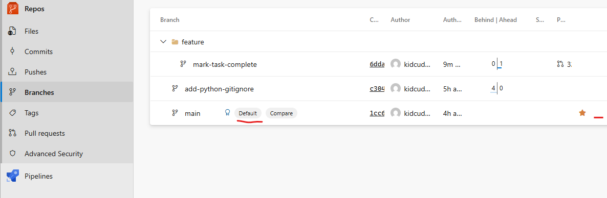
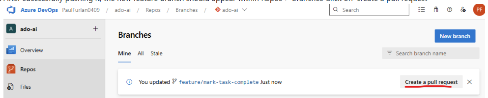

1)	Lets head on over to Azure DevOps (dev.azure.com) and create a new project.
    

 

2)	Next, in the bottom left click on ‘Project settings’ and enable ‘Repos’
    

 

3)	Refresh the browser window and in the left sidebar, click on ‘repos’
Next, in the “Push an existing repository from command line” section
make sure https is selected
and copy the ‘git remote add origin https://....” command up until the name of the project (do not copy the git push -u origin command)

 

4)	 Next, go back to GitHub Codespaces
and paste the command into the GitHub Copilot chat window but do not run it
Next, edit the command by replacing ‘origin’ with ‘ado’
Then copy it from the GitHub Copilot Chat input field and paste it in the terminal

 

5)	Verify that the remote repository was successfully added by running the following command in the terminal
git remote -v

 

6)	Next, we will need an Azure DevOps access token to be able to push code from codespaces to Azure DevOps
In Azure Devops, click on user settings at the top right
And click on ‘Personal Access Tokens’ 

 

7)	Click on the ‘New Token’ button 
Input ‘ado-ai’ as the name for the token 
select ‘Custom defined’ scopes 
Then at the bottom click on “Show all scopes” 
In Agent Pools, select “Read & manage” 
In Build, select “read & execute” 
In the Code section, select ‘full” 
In Packaging, select “Read, write & manage” 
In Pipeline resources select “use and manage” 
In Release, select “Read, write, execute & manage” 
In Service connections, select “Read, query & manage” 
and click on ‘create’ 
Next it will output the token, be sure to write it down somewhere safe as we will be using it throughout the remaining labs

 

8)	Next, lets go back to GitHub Codespaces, and run:
git push -u ado –all
Upon hitting enter, you will be prompted for the (password) which will be the token we generated in the previous step.
So go ahead and paste it in that window (refer to screenshot)

 

9)	If the push was successful, you should see a message like the following:

 

10)	Next, lets start a new chat and make use of role-based prompting to ask the agent to implement a new feature to mark tasks as complete:
As a junior software engineer with basic python skills, implement the “mark task complete” feature for this to-do list application in a new feature branch. 
Make the code functional but include a subtle bug that a senior reviewer can catch during code review. Also, don’t update the readme.md file

 

11)	 Next, in the left sidebar, click on ‘publish branch’ and select ‘ado’ and paste the token again

 

12)	 After successfully pushing it, the new feature branch should appear within Repos > Branches. If the 'main' branch does not appear as the default branch, click on the ellipsis on the right side and select 'set as default branch'

 
Next, Click on 'create a pull request'

 

13)	 Lets add ourselves as the required reviewer and click on create

 

14)	 Now from the left menu, at the very bottom, lets open project settings in a new tab
Click on repositories, and then on the policies tab.
and on the ‘+’ button in the ‘Branch Policies’ section

 

15)	Select, ‘Protect the default branch of each repository’
and click on create

 

16)	In the next screen, enable the ‘require a minimum number of reviewers’ 
Input 1 for minimum number of reviewers
and check the box labeled as “Allow requestors to approve their own changes’

 

17)	Now go to pull requests
and you should see a tag called “Required” which means that it requires our review

 

18)	When accessing the pull request, the reviewer can click on the ‘Files’ tab to review the changes in the pull request

 

19)	Alright, let’s go back to Codespaces and pretend a senior software engineer will be reviewing these changes.
In GitHub Copilot chat, input:
As a senior software engineer with advanced python skills, review this “feature/mark-complete” feature branch for this to-do list application. 
Identify and fix any bugs, and update the README.md file to include the ‘mark_complete’ feature and commit the changes

 

20)	Once the changes are made, you may want to test the application to make sure its still working with:
python src/todo.py add "test the todo app 2"
python src/todo.py list
python src/todo.py complete 1
python src/todo.py list 

 

21)	 If the agent didn’t commit the changes, go ahead and commit them and add a descriptive message

 

22)	And next, sync the changes: 
 
📝 **Note:**It will ask for the Access token, so be sure to paste it in

 

23)	Once the changes have been pushed, our pull request should now have 2 commits/2 updates
You can review the changes in the files tab

 

24)	Lets go ahead and complete our pull request.
Click on the approve button, and then on the complete button

 

25)	Next, select the merge type (‘Rebase and fast-forward’ recommended to maintain a clean and linear history)
then mark the ‘Delete feature/mark-complete after merging’ checkbox 
and next click on complete merge

 

26)	Our PR is complete

 

27)	Next go back to codespaces, switch to the main branch and click on the update button.

 

